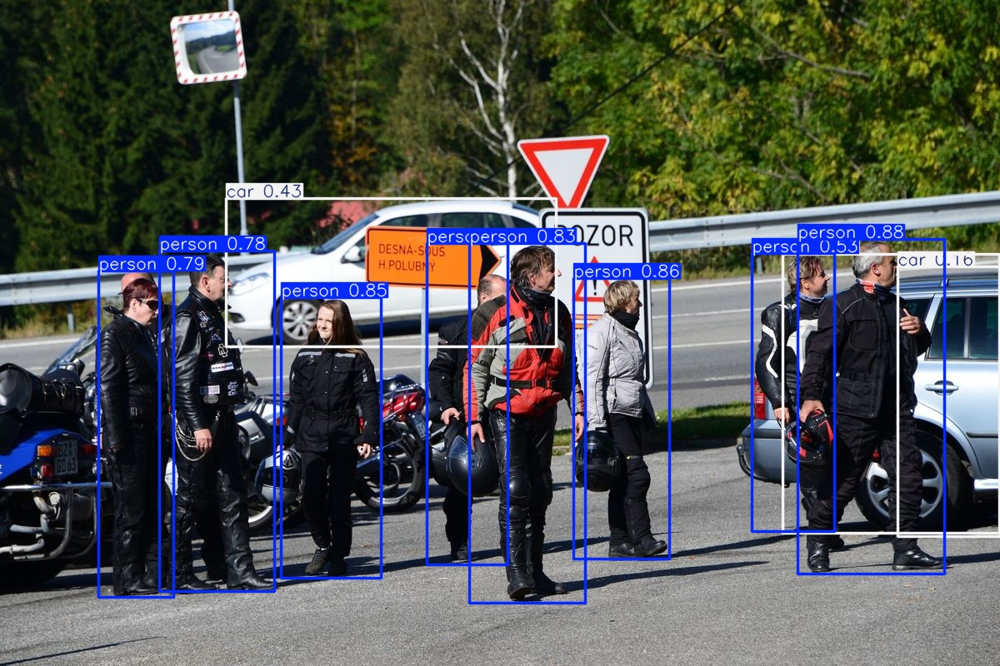

# 🚗 Person & Vehicle Detection (YOLOv11)

基于 YOLOv11 训练的行人与车辆检测模型，可识别行人、小汽车、大巴车和卡车。

---

## 📌 检测类别

| 类别 ID | 名称 |
|---------|------|
| 0 | person（行人）|
| 2 | car（小汽车）|
| 5 | bus（大巴车）|
| 7 | truck（卡车）|

---

## 🖼️ 效果展示

<!-- 放一张检测结果的截图，直观展示很重要 -->


---

## 📦 安装依赖

```bash
git clone https://github.com/Map1eWi/yolov11-traffic-detection.git
cd yolov11-traffic-detection
pip install -r requirements.txt
```

---

## 🔽 下载数据集

下载用于训练的COCO2017数据集，放至 `dataset/` 目录：

```bash
python download.py your_download_dir
```

---

## 🚀 快速开始

**图片检测**
```bash
python detect.py --source test_img/test.jpg --weights_dir weights/best.pt
```

**视频检测**
```bash
python detect_video.py --source test_video/test.mp4 --weights_dir weights/best.pt
```

---

## 🏃 训练

训练基于 COCO 数据集，仅使用 person/car/bus/truck 四类：

```bash
python train.py --data_config coco.yaml --epochs 50 --imgsz 512 --batch 8
```

**训练配置**

| 参数 | 值 |
|------|----|
| 基础模型 | YOLOv11s |
| 训练轮数 | 50 epochs |
| 图像尺寸 | 512×512 |
| 训练设备 | NVIDIA GPU (CUDA) |
| 数据集 | COCO 2017 |

---

## 📄 License

MIT License
